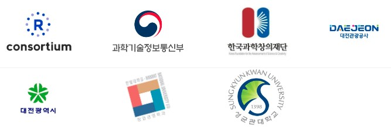

```{r setup, include=FALSE}
## [GitHub Repo.] statkclee/shiny-apps

knitr::opts_chunk$set(echo = FALSE, message=FALSE, warning=FALSE,
                      comment="", digits = 3, tidy = FALSE, prompt = FALSE, fig.align = 'center')
library(tidyverse)
library(rvest)
library(lubridate)
```


```{r card-groups}
library(bs4cards)

shiny_list <- list(
  tibble(
    title = "원주율(π)",
    image = "assets/images/life-of-pi.gif",
    text = "몬테카를로 모의시험 방법으로 원주율 계산 (Shiny App)",
    link = "https://r2bit.shinyapps.io/life_of_pi/",
    footer = "2022-06-02"
  ),
  tibble(
    title = "실용통계",
    image = "assets/hsData-favicon-180x180.png",
    text = "실용통계 데이터셋 (실행방법: CTRL + 클릭)",
    link = "https://statkclee.github.io/shiny-apps/flexdashboard/hsData.html",
    footer = "2022-06-03"
  ),
  tibble(
    title = "숫자 맞추기",
    image = "assets/favicon-guess-number.png",
    text = "기회는 3번, 1~20사이 숫자 맞추기",
    link = "https://r2bit.shinyapps.io/guess_number/",
    footer = "2022-06-04"
  ),
  tibble(
    title = "추론: flexdashboard",
    image = "assets/favicon-inference.png",
    text = "가설 검정 - 평균, 비율, 분산에 대한 추론",
    link = "https://r2bit.shinyapps.io/inference/",
    footer = "2022-06-05"
  ),
  tibble(
    title = "추론: Shiny",
    image = "assets/favicon-shiny-infer.png",
    text = "가설 검정 - 평균, 비율, 분산에 대한 추론",
    link = "https://r2bit.shinyapps.io/infer_shiny/",
    footer = "2022-06-10"
  ),
  tibble(
    title = "확률분포",
    image = "assets/favicon-distribution.png",
    text = "정규, 이산형, 연속형 분포",
    link = "https://r2bit.shinyapps.io/dist_shiny/",
    footer = "2022-06-15"
  ),  
  tibble(
    title = "회귀분석",
    image = "assets/favicon-regression.png",
    text = "선형 회귀 분석",
    link = "https://r2bit.shinyapps.io/reg_shiny/",
    footer = "2022-06-16"
  ),    
  tibble(
    title = "t-분포&정규분포",
    image = "assets/favicon-tdist.png",
    text = "t-분포와 표준정규분포 특성",
    link = "https://r2bit.shinyapps.io/tdist_shiny/",
    footer = "2022-06-17"
  ),    
  tibble(
    title = "중심극한정리",
    image = "assets/favicon-clt.png",
    text = "대수의법칙과 중심극한정리",
    link = "https://r2bit.shinyapps.io/clt_shiny/",
    footer = "2022-06-17"
  ),    
  tibble(
    title = "모의실험",
    image = "assets/favicon-simulation.png",
    text = "동전, 주사위 던지기 ...",
    link = "https://r2bit.shinyapps.io/simulation/",
    footer = "2022-06-12"
  ),
  tibble(
    title = "선거",
    image = "assets/favicon-krvote.png",
    text = "제20대 대통령선거 투표/득표",
    link = "https://r2bit.shinyapps.io/krvote_shinydashboard/",
    footer = "2022-06-13"
  ),
  tibble(
    title = "금융",
    image = "assets/favicon-loans.png",
    text = "주택담보대출 모의시험",
    link = "https://r2bit.shinyapps.io/loans_shiny/",
    footer = "2022-06-19"
  ) 
  
)

shiny_tbl <- shiny_list %>% 
  enframe() %>% 
  unnest(value)

shiny_tbl %>% 
  cards(
    title = title,
    text = text,
    link = link,
    image = image,
    footer = footer,
    layout = "label-left", 
    width = 3
  )
```


# 개발도구

[bs4cards](https://bs4cards.djnavarro.net/articles/articles/layouts.html)

# 후원

이 프로그램은 과학기술진흥기금 및 복권기금의 재원으로 운영되고,과학기술정보통신부와 한국과학창의재단의 지원을 받아 수행된 성과물로 우리나라의 과학기술 발전과 사회적 가치 증진에 기여하고 있습니다. 성균관대학교 경제학과, 한밭대학교 창업경영학과에서 장소를 지원해 주셨으며, 대전과학문화거점센터 지원도 받았음을 밝혀둡니다.




